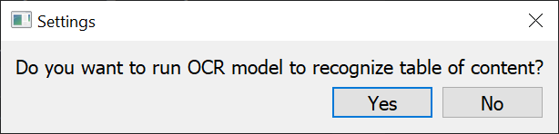
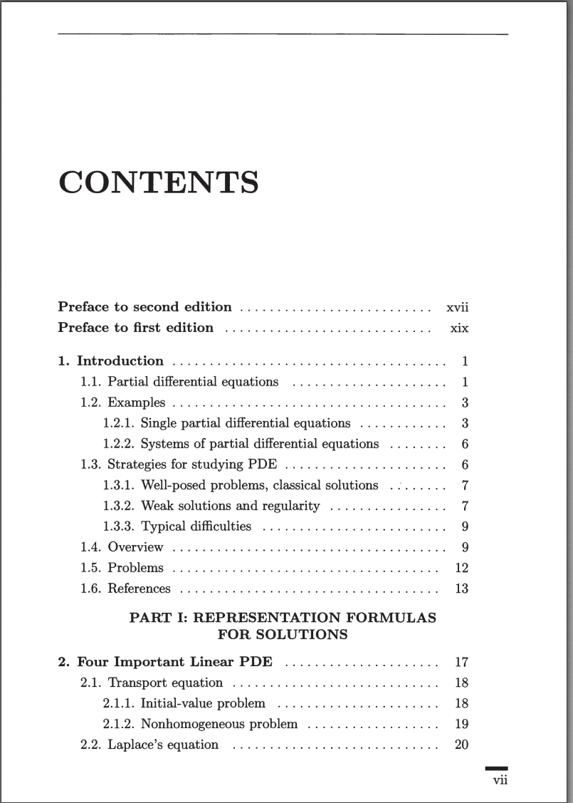
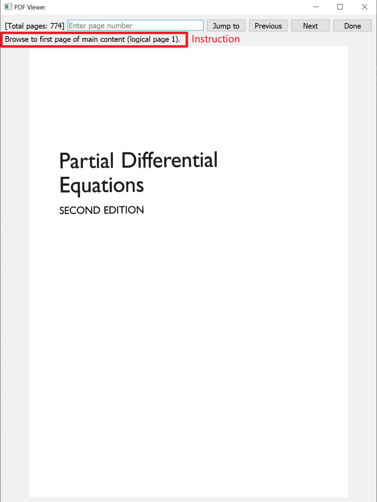
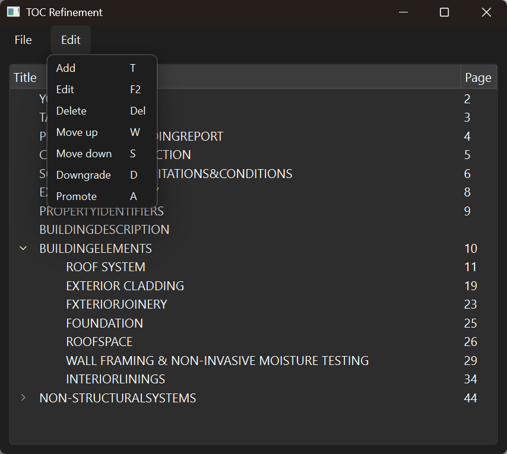
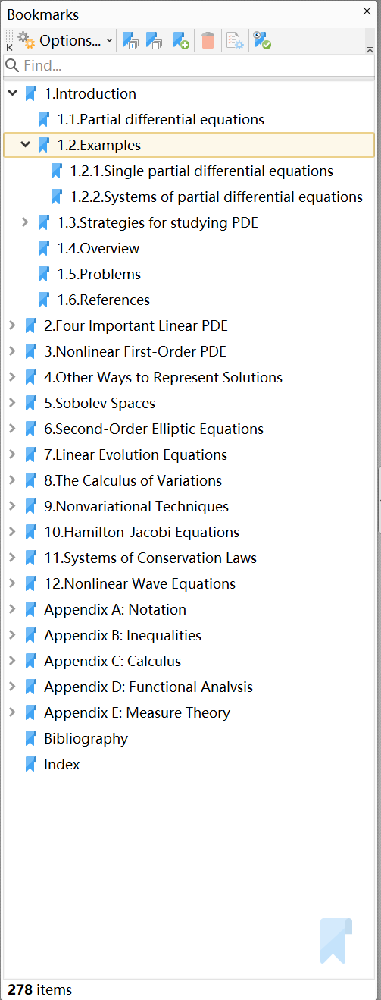

# TOC to bookmarks
 Automatically create bookmarks from "table of content" for `*.pdf` books


## Acknowledgement

[PaddleOCR2Pytorch](https://github.com/frotms/PaddleOCR2Pytorch)

Few pages from "Partial Differential Equations" by "Lawrence C. Evans" are used as an example in this document.

## Install

Create and activate a Python virtual environment.

```
pip install -r requirements.txt --extra-index-url https://download.pytorch.org/whl/cu130
```

## Usage

Run `python main.py`.

Term: 

TOC = table of content

Assumptions:

- TOC text direction is horizontal.
- Levels of TOC entries (aka. chapter/section titles) are distinguished by its text indent.
- TOC entries of the same level are aligned left.
- Page numbers are aligned right.
- Page numbers of the main part are Arabic numbers. The titles where page numbers are Roman numbers such as prologue, preface, have to be removed.
- Sizes of all pages in TOC are the same.

### 1. Set OCR

Answer whether to enable OCR.



If enabled, the program will ask you the start and end page number of the book's TOC. 

Example:



The OCR part will recognize these pages and generate a TOC.

### 2. Identify page range

The program will let you choose the PDF book which you want to generate the TOC.

Then, it will start a PDF viewer. Please follow the instruction (rectangle in the following image). You should browse to the mentioned page with "Jump to", "Previous", or "Next". When you arrive the mentioned page, click "Done".



If you enabled OCR, you will be asked:

- The first page of TOC in the book.
- The last page of TOC in the book.
- The first page of the main content, corresponding to logical page (Arabic number 1) in the TOC.

If you disabled OCR, only the third page will be asked.

### 3. Edit TOC

If you enabled OCR, OCR may be inaccurate; if you disabled OCR, you have to manually input the TOC. Anyway, you need to manually edit TOC.

Features:

| Shortcut | Function  | Description                                                  |
| -------- | --------- | ------------------------------------------------------------ |
| W        | Move Up   | Move up a single row.                                        |
| S        | Move Down | Move down a single row.                                      |
| A        | Promote   | When the selected items are children of the item above, take them out to be sibling of their original parent item. |
| D        | Downgrade | Let selected items be the children of the item above.        |
| Shift    |           | Select a starting item, hold "Shift" and select an ending item, the items between them will be all selected. |
| Ctrl+A   |           | Select all items.                                            |
| F2       | Edit      | Edit single row.                                             |
| T        | New       | Create a new item below the single selected item. If multiple rows are selected, use the first one. |
| Del      | Delete    | Delete multiple rows.                                        |




Select "File > Accept" if you are satisfied with the result.

### 4. Get the result

The program will export the PDF book with bookmarks based on TOC into a new file, which is in the same folder as the input file. The file name is the input file adding `_outlined` suffix.

The program generates TOC in format of PDF bookmarks like the following.


